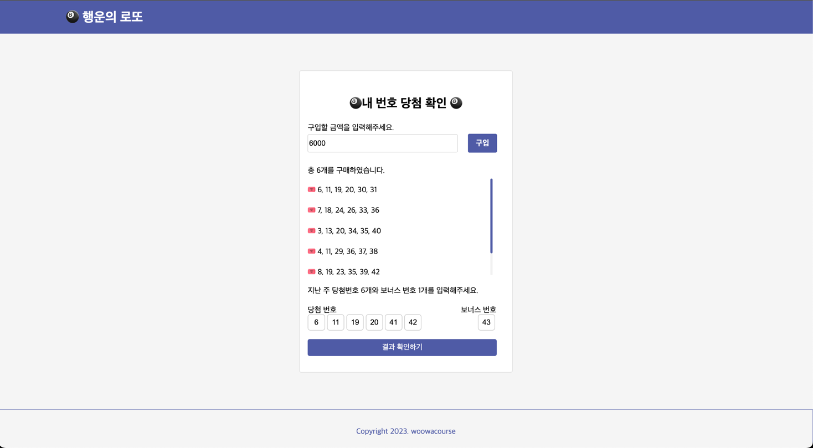
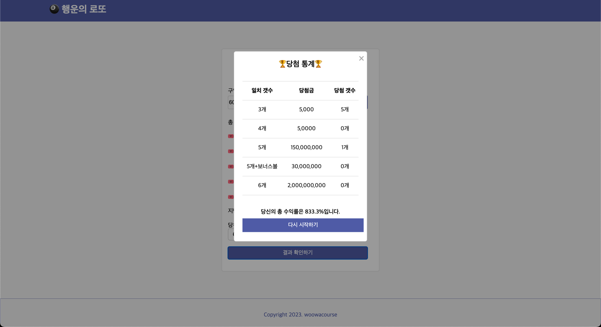

<h1 align="middle">🎱</h1>
<h2 align="middle">level1 - 행운의 로또</h2>
<p align="middle">자바스크립트로 구현 하는 로또 어플리케이션</p>





## 🦉우아한테크코스 5기 FE_부엉이(이승환)

## 🌎배포 url

- https://sh981013s.github.io/javascript-lotto/dist/

## 🫡 중점 사항

### 1. 모듈화에 대해 고민 - 도메인과 UI 관심사의 분리

- 1차 미션에서 `Console` 기반으로 구현한 Lotto Game 의 도메인 로직을 변경하지 않고
재사용해 `web` 으로 구현.

### 2. 일관성 있고 의도가 드러나는 마크업을 작성하기 위해 노력

- 목적에 맞는 HTML 태그 (semantic tags) 사용
- CSS 속성 `선언 순서`의 일관성을 고려 ⤵️

```
property order convention

1.  Positioning properties: position, top, right, bottom, left, z-index

2.  Box-model properties: display, float, clear, width, height, margin, padding, border

3.  Typography properties: font, line-height, text-align, text-transform, text-decoration, letter-spacing, word-spacing

4.  Visual properties: color, background, opacity, box-shadow, transform

5.  Misc properties: cursor, overflow, visibility
```

## 🏃🏻‍♂️ 실행 방법

```bash

$https://github.com/sh981013s/javascript-lotto.git

$npm i

$npm run start-step2

```


