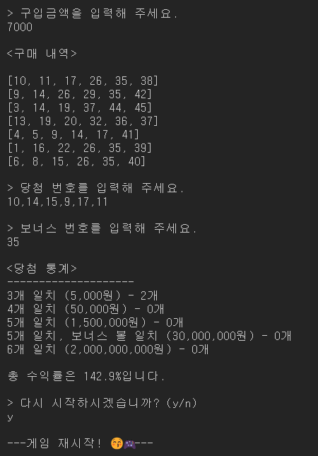
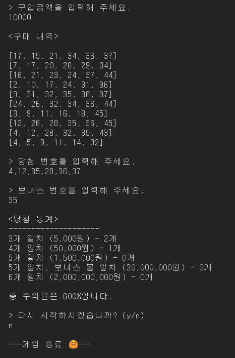

<h1 align="middle">🎱</h1>
<h2 align="middle">level1 - 행운의 로또</h2>
<p align="middle">자바스크립트로 구현 하는 로또 어플리케이션</p>

# 실행 방법

### 테스트

```dash
npm run test
```

### 로또 게임 실행

```dash
npm run start-step1
```

## 실행 결과




## 🏫 학습 목표

- UI와 도메인 영역을 분리한다.
- TDD를 적용해 단위 테스트 기반으로 점진적인 리팩토링을 시행한다.

## 🏃‍♀️ 구현 사항

- 사용자는 가격인 1000원인 로또를 1000원 단위의 금액으로 구입할 수 있다.
- 사용자에게 발행되는 로또의 갯수는 구매 금액에 비례하지만 사용자는 최소 1장 이상 50장이하의 로또를 구매할 수 있다.
- 사용자에게 발행되는 로또 번호와 당첨번호는 1이상 45이하의 중복되지 않는 6개의 정수로 이루어진다.
- 보너스 번호는 당첨번호에 포함되지 않는 1이상 45이하의 1개의 정수이다.
- 사용자에게 당첨번호와 보너스 번호에 대한 입력을 받고, 사용자는 당첨번호를 입력할때 쉼표(",")를 사용해 숫자를 구별해야 한다.
- 사용자에게 발행된 로또와 당첨번호,보너스 번호를 비교해 당첨 결과와 수익률을 출력한다.
- 당첨 결과와 수익률을 출력한 후, 게임 재시작 여부를 입력받는다.
  - 받을 수 있는 입력값은 "y" 또는 "n"이다.
  - "y"를 입력 받으면 게임을 재시작하고, "n"을 입력 받으면 게임을 종료한다.

### 폴더 구조

| 폴더명    | 설명                                                                  |
| --------- | --------------------------------------------------------------------- |
| constants | 상수 관리                                                             |
| domains   | 도메인 로직 관리, 상태(데이터)들은 해당 도메인 파일에서 관리하도록 함 |
| services  | 도메인과 뷰를 연결하는 모듈들 관리                                    |
| utils     | 유틸 함수, 객체 관리                                                  |
| views     | 뷰 관리                                                               |

### 파일 설명

<details>
<summary>📜 파일 트리 보기</summary>
<div markdown="1">

```
src
 ┣ constants
 ┃ ┣ delimiters.js : 글자등을 구분할 때 사용되는 특수 문자 상수 관리
 ┃ ┣ index.js
 ┃ ┣ messages.js : 입출력 관련 상수 관리
 ┃ ┗ rules.js : 게임 룰에 관련 된 상수 관리
 ┣ domains
 ┃ ┣ index.js
 ┃ ┣ LottoGame.js : 로또 게임의 도메인 로직들(LottoMachine, Statistics, WinningLotto)을 전반적으로 관리하는 모듈
 ┃ ┣ LottoMachine.js : 구입 금액에 따른 로또들을 발행하고 구입금액과 발행된 로또들을 관리하는 모듈
 ┃ ┣ Statistics.js : 당첨 번호,보너스 번호와 발행된 로또 번호의 일치 여부 결과를 이용해 통계(등수별 일치 개수)와 수익률을 계산하는 모듈
 ┃ ┣ Validator.js : 유효성 검사를 관리하는 모듈
 ┃ ┗ WinningLotto.js : 당첨 번호와 보너스 번호에 대한 사용자의 입력값으로 당첨 로또와 보너스 번호를 생성해 당첨 번호,보너스 번화와 발행된 로또를 비교하는 모듈
 ┣ services
 ┃ ┣ GameController.js :UI와 도메인 사이에서 InputController 를 통해 입력값을 받아와 LottoGame을 실행하고 해당 결과들을 UI에게 넘겨서 로또 미션의 전반적인 기능이 돌아가도록 하는 모듈
 ┃ ┣ index.js
 ┃ ┗ InputController.js
 ┣ utils
 ┃ ┣ Console.js : 콘솔 입출력에 대한 모듈
 ┃ ┣ index.js
 ┃ ┣ RandomNumber.js :랜덤 숫자 생성하는 모듈
 ┃ ┗ validatorsUtils.js : 유효성 검사 시에 사용되는 유틸 함수들 관리
 ┣ views
 ┃ ┣ index.js
 ┃ ┣ InputView.js
 ┃ ┗ OutputView.js
 ┣ GameApp.js : 게임 실행 시, GameController을 실행 해 게임을 진행하는 모듈
 ┣ step1-index.js
 ┗ step2-index.js

```

</div>
</details>
