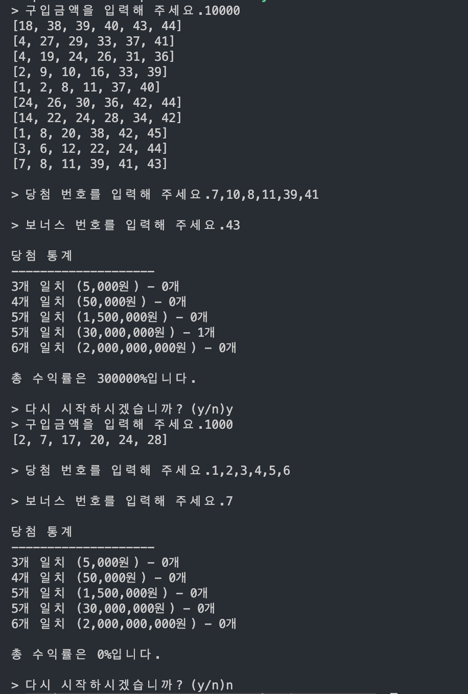

<h1 align="middle">🎱</h1>
<h2 align="middle">level1 - 행운의 로또</h2>
<p align="middle">자바스크립트로 구현 하는 로또 어플리케이션</p>

# 실행 방법

### 테스트

```dash
npm run test
```

### 로또 게임 실행

```dash
npm run start-step1
```

## 실행 결과



## 🏫 학습 목표

- UI와 도메인 영역을 분리한다.
- TDD를 적용해 단위 테스트 기반으로 점진적인 리팩토링을 시행한다.

## 🏃‍♀️ 구현 사항

- 사용자는 가격인 1000원인 로또를 1000원 단위의 금액으로 구입할 수 있다.
- 사용자에게 발행되는 로또의 갯수는 구매 금액에 비례하지만 사용자는 최소 1장 이상 50장이하의 로또를 구매할 수 있다.
- 사용자에게 발행되는 로또 번호와 당첨번호는 1이상 45이하의 중복되지 않는 6개의 정수로 이루어진다.
- 보너스 번호는 당첨번호에 포함되지 않는 1이상 45이하의 1개의 정수이다.
- 사용자에게 당첨번호와 보너스 번호에 대한 입력을 받고, 사용자는 당첨번호를 입력할때 쉼표(",")를 사용해 숫자를 구별해야 한다.
- 사용자에게 발행된 로또와 당첨번호,보너스 번호를 비교해 당첨 결과와 수익률을 출력한다.
- 당첨 결과와 수익률을 출력한 후, 게임 재시작 여부를 입력받는다.
  - 받을 수 있는 입력값은 "y" 또는 "n"이다.
  - "y"를 입력 받으면 게임을 재시작하고, "n"을 입력 받으면 게임을 종료한다.

### 폴더 구조

| 폴더명    | 설명                                                                  |
| --------- | --------------------------------------------------------------------- |
| constants | 상수 관리                                                             |
| domains   | 도메인 로직 관리, 상태(데이터)들은 해당 도메인 파일에서 관리하도록 함 |
| services  | 도메인과 뷰를 연결하는 모듈들 관리                                    |
| utils     | 유틸 함수, 객체 관리                                                  |
| views     | 뷰 관리                                                               |

### 파일 설명

<details>
<summary>📜 파일 트리 보기</summary>
<div markdown="1">

```
src
├── GameApp.js
├── constants
│   ├── delimiters.js
│   ├── index.js
│   ├── messages.js
│   └── rules.js
├── domains
│   ├── LottoGame.js :
│   ├── LottoMachine.js
│   ├── Statistics.js
│   ├── Validator.js
│   ├── WinningLotto.js
│   └── index.js
├── services
│   ├── GameController.js
│   ├── InputController.js
│   └── index.js
├── step1-index.js
├── step2-index.js
├── utils
│   ├── Console.js
│   ├── RandomNumber.js
│   ├── index.js
│   └── validatorsUtils.js
└── views
    ├── InputView.js
    └── OutputView.js
```

</div>
</details>
