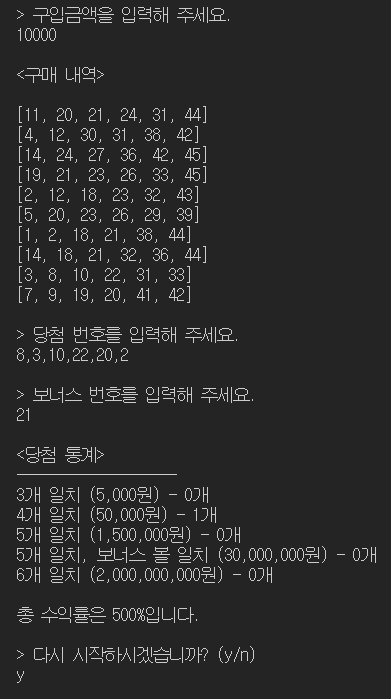
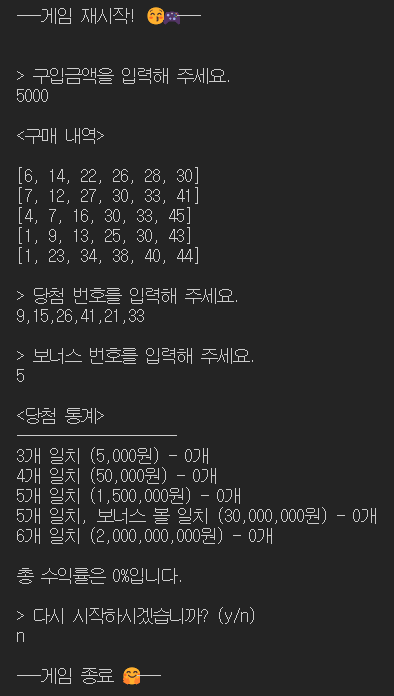
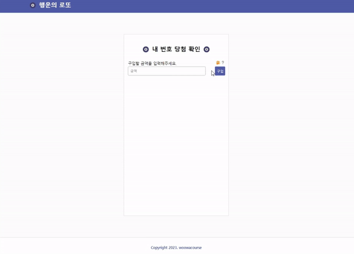
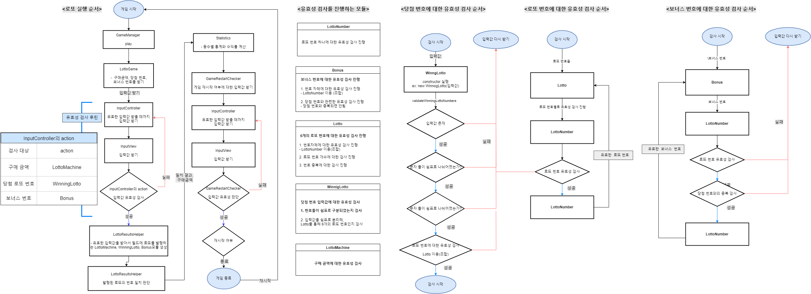

<h1 align="middle">🎱</h1>
<h2 align="middle">level1 - 행운의 로또</h2>
<p align="middle">자바스크립트로 구현 하는 로또 어플리케이션</p>

# 실행 방법

## 🎮 실행 방법

### 배포

```dash
npm run build-step2
```

### 테스트

```dash
npm run test
```

### 1단계 - 콘솔 기반 로또 게임 실행

```dash
npm run start-step1
```

### 2단계 웹 기반 로또 실행 방법

#### 1. github page

- [🖱️ 웹 기반 로또 게임 github page 바로가기](https://badahertz52.github.io/javascript-lotto/dist/)

#### 2. local

```dash
npm run start-step2
```

## 실행 결과

### step1 (콘솔)




### step2(웹)



## 🏫 학습 목표

### step1

- UI와 도메인 영역을 분리한다.
- TDD를 적용해 단위 테스트 기반으로 점진적인 리팩토링을 시행한다.

### step2

#### 우테코 학습 목표

- **모듈화에 대해 고민한다. (도메인과 UI 관심사의 분리)**

  - 1단계에서 구현한 도메인 로직을 (최대한) 수정하지
    않고, UI만 변경한다.

- **일관성 있고 의도가 드러나는 마크업을 작성하기 위해 노력한다.**

- **목적에 맞는 HTML 태그를 사용한다.**
- **CSS 속성 선언 순서의 일관성을 고려한다.**
  - CSS 문법 사용에 익숙해진다.
  - CSS 속성은 가능하면 축약형(shorthand)을 사용한다.
  - flexbox를 활용해 레이아웃을 구성한다.

#### 개인적인 구현 목표

우테코 미션 외의 저의 개인적인 미션 구현 시 목표에요.

- HTML 시멘틱 태그를 사용한다.
- 스크린 리더기를 생각해 input의 label을 넣는다.
- 많이 사용하는 css 속성들은 변수로 만들어서 재사용한다.
- 반응형 웹을 만든다.
- UX 생각하기
  - 피그마에 없지만 사용자가 입력값에 대한 요구사항과 오류를 알 수 있도록 토클 메세지와 오류 메세지를 화면에 띄운다.
  - 입력값에 맞는 형식을 작서할 수 있도록 input의 type과 min,max 속성을 활용한다.
  - 게임 결과에 대한 팝업창을 열면 스크롤을 움직여서 팝업창의 시작점에서 팝업창을 볼 수 있도록 한다.
- 1단계에서 만든 상수 객체를 활용해 HTML의 내용을 만든다.(EX:구매 금액의 요구 사항등)

## 🏃‍♀️ 구현 사항

- 사용자는 가격인 1000원인 로또를 1000원 단위의 금액으로 구입할 수 있다.
- 사용자에게 발행되는 로또의 갯수는 구매 금액에 비례하지만 사용자는 최소 1장 이상 50장이하의 로또를 구매할 수 있다.
- 사용자에게 발행되는 로또 번호와 당첨번호는 1이상 45이하의 중복되지 않는 6개의 정수로 이루어진다.
- 보너스 번호는 당첨번호에 포함되지 않는 1이상 45이하의 1개의 정수이다.
- 사용자에게 당첨번호와 보너스 번호에 대한 입력을 받고, 사용자는 당첨번호를 입력할때 쉼표(",")를 사용해 숫자를 구별해야 한다.
- 사용자에게 발행된 로또와 당첨번호,보너스 번호를 비교해 당첨 결과와 수익률을 출력한다.
- 당첨 결과와 수익률을 출력한 후, 게임 재시작 여부를 입력받는다.
  - 받을 수 있는 입력값은 "y" 또는 "n"이다.
  - "y"를 입력 받으면 게임을 재시작하고, "n"을 입력 받으면 게임을 종료한다.

### 폴더 구조

| 폴더명    | 설명                                                                  |
| --------- | --------------------------------------------------------------------- |
| constants | 상수 관리                                                             |
| domains   | 도메인 로직 관리, 상태(데이터)들은 해당 도메인 파일에서 관리하도록 함 |
| services  | 도메인과 뷰를 연결하는 모듈들 관리                                    |
| utils     | 유틸 함수, 객체 관리                                                  |
| views     | 뷰 관리                                                               |
| web       | 웹 기반 로또 게임 구현에 필요한 파일 관리                             |

### 파일 설명

<details>
<summary>📜 파일 트리 보기</summary>
<div markdown="1">

```
src
 ┣ constants
 ┃ ┣ delimiters.js : 글자등을 구분할 때 사용되는 특수 문자 상수 관리
 ┃ ┣ index.js
 ┃ ┣ messages.js : 입출력 관련 상수 관리
 ┃ ┗ rules.js : 게임 룰에 관련 된 상수 관리
 ┣ domains
 ┃ ┣ Bonus.js : 보너스 번호에 대한 유효성 검사 및 로또 번호에 보너스 번호가 있는 지 여부를 확인하는 모듈
 ┃ ┣ GameRestartChecker.js : 게임 재시작 입력값에 대한 유효성 검사와 게임 재시작 여부를 확인하는 모듈
 ┃ ┣ index.js
 ┃ ┣ Lotto.js :로또 번호들에 대한 유효성 검사를 진행하고 유효한 로또 번호들을 관리하는 모듈
 ┃ ┣ LottoMachine.js : 구입 금액에 따른 로또들을 발행하고 구입금액과 발행된 로또들을 관리하는 모듈
 ┃ ┣ LottoNumber.js :한 개의 로또 번호에 대한 유효성 검사를 진행하고 유효한 로또 번호를 관리하는 모듈
 ┃ ┣ LottoResultsHelper.js : LottoMachine,WinningLotto,Bonus 모듈을 관리하는 상위 모듈로, 이들을 실행시켜서 발행된 로또 티켓 모두에 대한 당첨번호와 보너스 번호화의 일치 결과를 계산하는 모듈
 ┃ ┣ Statistics.js : 당첨 번호,보너스 번호와 발행된 로또 번호의 일치 여부 결과를 이용해 통계(등수별 일치 개수)와 수익률을 계산하는 모듈
 ┃ ┗ WinningLotto.js : 유효성 검사 유틸함수와 Lotto를 활용해 당첨 로또 번호들에 대한 유효성 검사를 진행하며 유효한 당첨 번호들 관리하하고 발행된 로또 티켓 한 장에 대한 당첨 번호와 보너스 번호를 비교하는 모듈
 ┣ services
 ┃ ┣ GameManager.js :LottoGame의 상위 모듈로, LottoGame를 실행 게임을 시작하고 GameRestartChecker를 통해 게임 재시작과 종료를 관리하는 모듈
 ┃ ┣ index.js
 ┃ ┣ InputController.js
 ┃ ┗ LottoGame.js :InputController와 LottoResultHelper,Statistics를 실행해 로또 게임을 진행하는 모듈로
 ┣ utils
 ┃ ┣ Console.js : 콘솔 입출력에 대한 모듈
 ┃ ┣ index.js
 ┃ ┣ RandomNumber.js :랜덤 숫자 생성하는 모듈
 ┃ ┗ validatorsUtils.js : 유효성 검사 시에 사용되는 유틸 함수들 관리
 ┣ views
 ┃ ┣ index.js
 ┃ ┣ InputView.js
 ┃ ┗ OutputView.js
 ┣ web
 ┃ ┣ css
 ┃ ┃ ┣ main.css
 ┃ ┃ ┣ _app.css
 ┃ ┃ ┣ _common.css
 ┃ ┃ ┣ _contents.css
 ┃ ┃ ┣ _popup.css
 ┃ ┃ ┣ _reset.css
 ┃ ┃ ┣ _rule.css
 ┃ ┃ ┗ _style-constants.css
 ┃ ┣ js
 ┃ ┃ ┣ HtmlTextInjectorWithConstants.js
 ┃ ┃ ┣ HtmlTextInjectorWithGameResults.js
 ┃ ┃ ┣ LottoMachineGenerator.js
 ┃ ┃ ┣ StatisticsPopupController.js
 ┃ ┃ ┣ utils.js
 ┃ ┃ ┣ WebLottoGameController.js
 ┃ ┃ ┗ WinningLottoAndBonusGenerator.js
 ┣ GameApp.js : 게임 실행 시,  GameManager을 실행 해 게임을 진행하는 모듈
 ┣ step1-index.js
 ┗ step2-index.js

```

</div>
</details>

### 로또 미션 순서도 및 구조

#### step1

<details>
<summary>🔍 로또 미션 순서도 및 구조 보기</summary>
<div markdown="1">



</div>
</details>
