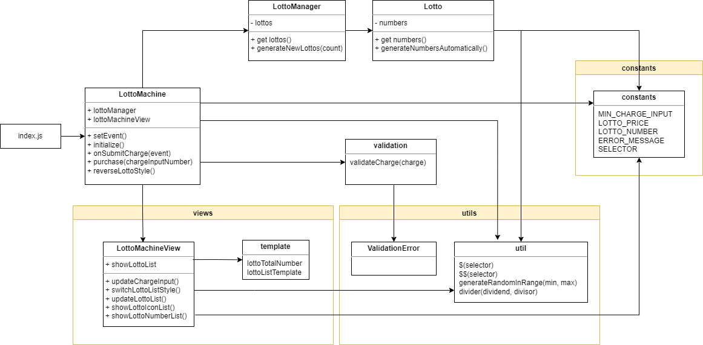

<p align="middle" >
  
</p>
<h2 align="middle">level1 - 행운의 로또</h2>
<p align="middle">자바스크립트로 구현 하는 로또 어플리케이션</p>
<p align="middle">
  
  
  
  
  
</p>

## 기능 목록

1. - [x] 로또 구입 금액 입력 기능

   - 입력 값은 정수여야 한다.

   - 입력 최소 값은 1,000이다.

2. - [x] 로또 구입 기능

   - 구입 버튼을 누르면, 입력 금액으로 구매할 수 있는 최대 갯수의 로또를 발급한다.

   - 로또 1장의 가격은 1,000원이다.

   - 각 로또의 로또 번호는 자동 생성한다.

   - 로또를 구입하고 남은 잔돈은 입력칸에 표시된다.

3. - [x] 로또 번호 자동 생성 기능

   - 로또 1장은 6개의 번호를 가진다.

   - 각 번호는 1 이상, 45 이하의 정수다.

   - 각 번호는 중복되지 않는다.

4. - [x] 구입한 로또 출력 기능

   - 번호 보기 토글을 통해 로또 출력 방식이 결정된다.

   - 번호 보기 off 상태

     - 구입한 로또 개수만큼 로또 이미지를 출력한다.

   - 번호 보기 on 상태

     - 구입한 로또 개수만큼 로또 이미지와 각 로또의 번호를 출력한다.

5. - [x] 로또 당첨 번호 입력

   - 중복없는 숫자들이여야 한다.

   - 1 ~ 45 사이의 값이여야 한다.

   - 당첨 번호 6개와 보너스 번호 1개로 이루어져있다.

6. - [ ] 결과 확인 기능

   - 결과 확인하기 버튼을 누르면 당첨 통계, 수익률을 모달로 확인할 수 있다.

   - 로또 당첨 금액은 고정되어 있는 것으로 가정한다.

   - 다시 시작하기 버튼을 누르면 초기화 되서 다시 구매를 시작할 수 있다.

   - 다시 시작하기 버튼을 눌렀을 때 일어나야하는 일

     - input안이 비어있어햐 한다.

     - 입력 금액란의 disable이 풀려있어야 한다.

     - 총 0개를 구매하였습니다.라고 뜨며 로또들의 데이터가 없어야한다.

     - 토글 요소도 꺼진 상태로 시작해야한다.

7. - [x] 결과 확인 화면

   - 당첨 갯수 및 수익률을 확인할 수 있어야 한다.

   - 모달 창을 끄는 조건

     - x 버튼 누르기

     - 모달 바깥 영역 누르기

     - ESC 누르기

### 테스트 요구사항

- 위 기능들이 정상적으로 동작하는지 Jest를 이용하여 단위 테스트를 작성한다.

### UI

- Figma 시안을 기준으로 UI 템플릿을 작성한다.
  - HTML
  - CSS

## 구조도

<p align="middle" >
  
</p>

## ⚙️ Before Started

#### 개발 환경 가이드

개발 중에는 아래 명령어를 사용하여 webpack dev server를 띄워 현재 개발 중인 어플리케이션을 확인할 수 있습니다.

```
npm run start
```

별도로 빌드를 해야 한다면 아래 명령어를 사용해주세요

```
npm run build
```

<br>

## 👏 Contributing

만약 미션 수행 중에 개선사항이 보인다면, 언제든 자유롭게 PR을 보내주세요.

<br>

## 🐞 Bug Report

버그를 발견한다면, [Issues](https://github.com/woowacourse/javascript-lotto/issues)에 등록해주세요.

<br>

## 📝 License

This project is [MIT](https://github.com/woowacourse/javascript-lotto/blob/main/LICENSE) licensed.
