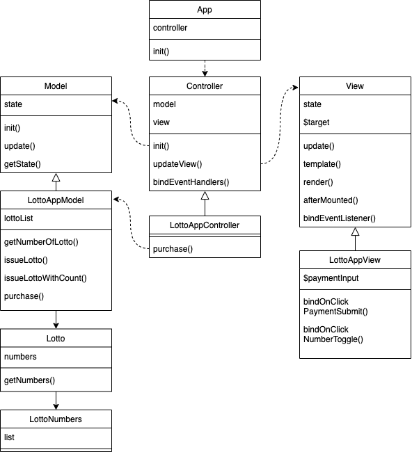

<p align="middle" >
  
</p>
<h2 align="middle">level1 - 행운의 로또</h2>
<p align="middle">자바스크립트로 구현 하는 로또 어플리케이션</p>
<p align="middle">
  
  
  
  
  
</p>

## 🧑‍💻 데모 페이지

[링크](http://woojeongmin.com/javascript-lotto/)

## 🔎 설계



## ⚙️ Before Started

#### 개발 환경 가이드

개발 중에는 아래 명령어를 사용하여 webpack dev server를 띄워 현재 개발 중인 어플리케이션을 확인할 수 있습니다.

```
npm run start
```

별도로 빌드를 해야 한다면 아래 명령어를 사용해주세요

```
npm run build
```

## 🎯 구현 기능목록

### 1단계

- #### 로또 로직

  - [x] 금액이 주어지면 발급할 로또 개수를 구할 수 있어야 한다.
  - [x] 입력된 금액의 유효성을 검증할 수 있어야 한다.
    - [x] 입력된 금액이 숫자가 아니면 에러를 throw한다.
    - [x] 1000으로 나눠서 안떨어지는 금액이 입려되면 에러를 throw한다.
    - [x] 입력된 금액이 1000부터 10000 사이가 아니면 에러를 throw한다.
  - [x] 로또 번호를 생성할 수 있어야 한다.
    - [x] 로또 번호는 정수여야 한다.
    - [x] 로또 번호는 1부터 45 사이여야 한다.
  - [x] 6개의 번호를 가진 로또를 발급할 수 있다.
  - [x] 계산된 로또개수만큼 로또를 자동 구매할 수 있어야 한다.

- #### UI

  - [x] 금액을 입력하여 로또를 구입할 수 있어야 한다.
  - [x] 구입한 모든 로또와 개수를 화면에 출력할 수 있어야 한다.
  - [x] 번호보기 스위치를 눌러 번호를 보여주고 숨길 수 있어야 한다.

## 📝 License

This project is [MIT](https://github.com/woowacourse/javascript-lotto/blob/main/LICENSE) licensed.
