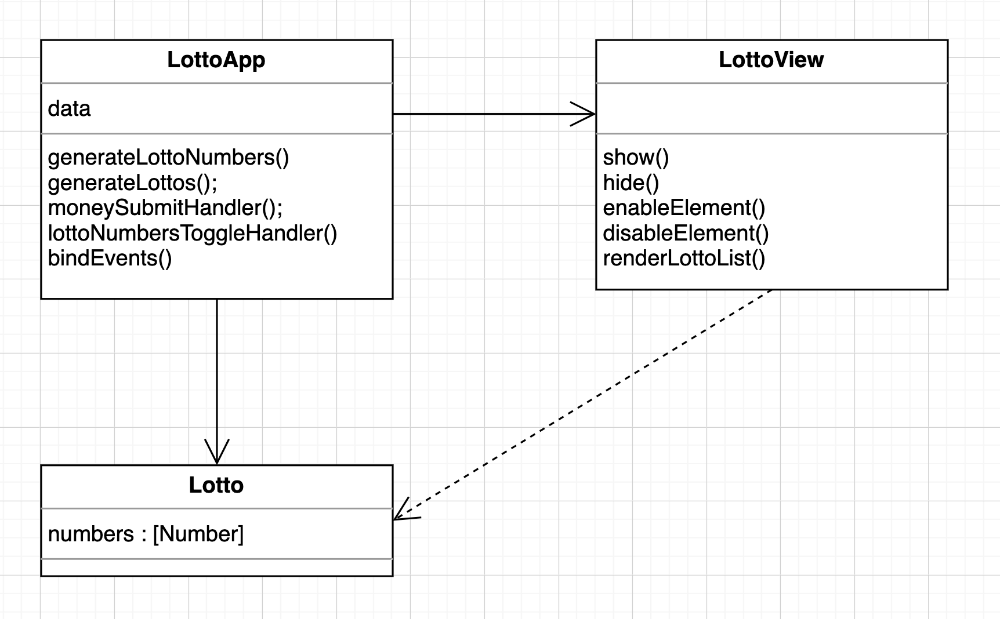
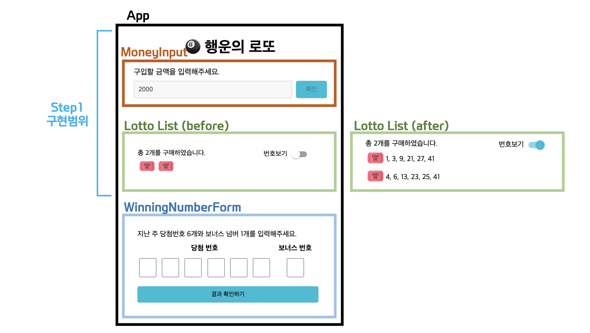

<p align="middle" >
  
</p>
<h2 align="middle">level1 - 행운의 로또</h2>
<p align="middle">자바스크립트로 구현 하는 로또 어플리케이션</p>
<p align="middle">


<a href="https://github.com/daybrush/moveable/blob/master/LICENSE" target="_blank">
  
  </a>
</p>

## 🔥 Projects!

<p align="middle">
  
</p>

## 데모 페이지

-[행운의 로또](https://sunhpark42.github.io/javascript-lotto/)

### ☝️ 미션 수행할 때 우리가 정한 목표

- 동작하는 쓰레기 코드부터 작성해보자

  - 기능 구현을 우선하고, 리팩토링을 진행한다
  - 처음부터 불필요하게 구조나 디자인 패턴을 적용하지 말자
  - 앱의 규모에 따라서 적절한 구조를 적용해보자

- `innerHTML`과 `innerText` 사용하지 않기!

  - DOM 생성은 무조건 `createElement`에서 시작하기

- UX를 조금 더 생각해보기

  - 구입 금액 입력후 Enter키를 눌러도 입력되도록 하기
  - 번호보기 토글 클릭 시 스위치 뿐만 아니라 라벨을 눌러도 동작하도록
  - 기타 등등...

- 테스트 코드를 먼저 작성하고 기능 구현하기

### 📝 앱 구조도

<p align="middle">
  
</p>

### 📝 컴포넌트 구조

<p align="middle">
  
</p>

### 📂 디렉토리 구조

```
src/js
  ├── object/
  │   └── Lotto.js
  ├── views/
  │   └── LottoView.js
  ├── constants.js
  ├── index.js
  └── utils.js
```

### 🎯 step1 구입 기능

- [x] 로또 구입 금액을 입력하면, 금액에 해당하는 로또를 발급해야 한다.
  - [x] 로또 구입 금액을 입력할 때 확인 버튼을 누르거나, Enter키로 입력할 수 있다.
  - [x] 구입 금액이 1,000원 단위가 아닐 경우, 구입할 수 있는 만큼만 구입한다. (e.g. 5,500원 -> 5장)
  - [x] 구입 금액이 0원 이상 1,000원 미만일 경우 alert 메시지를 표시한다.
  - [x] -1은 입력되지 않도록 한다.
  - [x] 로또 구입 금액 입력 후, input과 버튼을 비활성화한다.
  - [x] 로또 구입 금액 입력 후, 로또 목록이 나타나야 한다.
- [x] 로또 1장의 가격은 1,000원이다.
- [x] 소비자는 **자동 구매**를 할 수 있어야 한다.
  - [x] 자동 구매는 로또를 구입할 때, 각 로또마다 번호 6개가 자동으로 생성한 뒤 가지고 있어 한다.
- [x] 복권 번호는 번호보기 토글 버튼을 클릭하면, 볼 수 있어야 한다.
  - [x] 🎟️ 옆에 `1,2,3,4,5,6`과 같은 형태의 문자열도 번호를 보여줄 수 있어야 한다.
  - [x] 번호보기 토글이 꺼져있을 때는 로또의 개수만큼 🎟️가 표시되어야 한다.
  - [x] 번호보기 텍스트를 눌렀을 때도 동작되어야 한다.

### step1 테스트 항목

- [x] 사용자가 로또 구입 금액을 입력하고 확인 버튼을 누르면 금액에 맞는 로또가 화면에 보여진다.
  - [x] 구입 금액 입력 폼에 autoFocus가 되는지 확인한다.
  - [x] 구입 금액 입력 후, 당첨 번호 입력 폼에 autoFocus가 되는지 확인한다.
- [x] 사용자가 토글 버튼을 누르면 로또의 번호를 볼 수 있다.
- [x] 각 로또 안의 번호가 중복되지 않았는지 확인한다.

#### 예외사항(테스트)

- [x] 1000원 이하의 금액이 들어온 경우
  - [x] 사용자가 0원을 입력하면 '최소 1000원 이상의 금액을 입력하세요.'라고 경고창을 띄운다.
- [x] 사용자가 5500 원을 입력하면 화면에 로또가 5개 보여진다.

### 🎯🎯 step2 당첨 결과 기능

- [x] 페이지를 처음 로드했을 때, 구입할 금액 입력 폼에 autoFocus되도록 수정 구현 (step1 보완)
- [x] 구입할 금액 입력 후, 당첨 번호 입력 폼에 autoFocus되도록 구현
- [x] 당첨 번호 입력 중, 2자리 숫자가 입력되면 바로 다음 입력 폼으로 넘어가도록 구현
- [x] 결과 확인하기 버튼을 누르면 당첨 통계, 수익률을 모달로 확인할 수 있다.
  - [x] 결과 확인하기 버튼을 누르면 모달이 뜨도록 구현
  - [x] 입력된 당첨 번호가 1 ~ 45 사이의 중복되지 않는 숫자인지 확인한다.
  - [x] 모달이 떴을 때, 당첨금의 당첨 개수와 총 수익률이 계산되어 보여지도록 구현
  - [x] 모달이 뜬 상태에서 닫기를 눌렀을 때, 기존 화면에 변화가 없도록 한다.
- [x] 로또 당첨 금액은 고정되어 있는 것으로 가정한다.
- [x] 다시 시작하기 버튼을 누르면 초기화 되서 다시 구매를 시작할 수 있다.
  - [x] 처음 접속했을 때의 화면(구입할 금액 입력 폼만 보이는 상태)처럼 초기화한다.

### step2 테스트 항목

- [x] 로또 구입 후, 당첨 번호를 입력하고 결과 확인하기 버튼을 누르면, 모달에서 당첨 개수와 총 수익률을 확인할 수 있다.
  - [x] 모달이 잘 뜨는지 확인한다.
  - [x] 당첨금과 수익률이 정상 출력되는지 확인한다.
- [x] (Assertion) 로또 번호와 당첨 번호를 비교하여 일치하는 갯수가 정확하게 나오는지 확인한다.
- [x] 다시 시작하기 버튼을 눌렀을 때, 구입할 금액 입력 폼만 보이는지 확인한다.
- [x] 닫기 버튼을 눌렀을 때, 모달이 잘 닫히는지 확인한다.
- [x] 당첨 번호를 입력할 때, 2자리 숫자가 입력되면, 자동으로 다음 폼으로 focus되는지 확인한다.

#### 예외사항(테스트)

- [x] 입력된 당첨 번호가 1 ~ 45 사이의 숫자가 아니거나, 중복되면
  - [x] '1 ~ 45 사이의 숫자를 중복되지 않게 입력해주세요' 라는 경고창을 띄운다.

### 🎯🎯🎯 step3 수동 구매

- [x] 소비자는 수동 구매(스스로 구매 번호를 입력)를 할 수 있어야 한다.
  - 수동 구매를 위한 input UI는 스스로 구현한다.
  - [x] 사용자는 6개의 숫자를 입력할 수 있다.
  - [x] 입력 후 확인 / 엔터 키를 이용하여 수동구매를 진행한다.
  - [x] 한 번에 하나의 로또를 생성할 수 있다.
  - [x] 몇개의 로또가 남았는지 화면에 표시한다.
- [x] 수동 구매 후 남는 금액이 있다면 자동으로 구매할 수 있어야 한다.
  - [x] 사용자는 수동구매와 자동구매를 선택할 수 있다. (default : 수동구매)
- [x] 위 기능들이 정상적으로 동작하는지 Cypress를 이용해 테스트한다.

### step3 테스트 항목

- [x] 사용자가 구매금액을 입력한 후 확인 버튼을 누르면 수동구매 폼이 나온다.
- [x] 사용자는 수동구매 폼의 Input 에 1~45사이의 숫자를 입력한 후, 확인버튼을 누르면, 로또 목록에 로또가 하나씩 추가되는 것을 볼 수 있다.
  - [x] 사용자가 입력한 로또의 번호와, 생성된 로또의 번호가 같은지 확인한다.
- [x] 사용자는 '자동 구매' 버튼을 눌러 자동으로 남은 만큼의 로또를 생성할 수 있다.

## 웹 접근성 / 웹 표준 체크 리스트

- [x] 주요한 기능이 포함된 요소에는 적절한 태그명을 사용해야 한다
  - 서비스 전체 기능을 담는 container div 태그를 main으로 변경
  - 특정 기능을 담는 요소들을 section으로 구분.
- [x] 각 section 에는 header가 존재해야한다.
  - 각 섹션에 맞는 제목 추가
- [x] 각 input 에는 label이 붙어있는지?
  - label이 존재하지 않는 input폼은 aria-label로 label 대체 문구 표시
  - label에는 각 input이 무엇을 입력 받는지 명시한다.
- [x] 여섯 개의 당첨번호를 입력하는 폼은 fieldset으로 묶어주고 legend로 설명을 곁들임
- [x] 하나의 HTML 문서에는 하나의 autofocus만
- [x] modal의 경우는 role="dialog" aria-modal="true" 속성 부여
- [x] modal에서 닫기 버튼에 aria-label="닫기" 부여

- [x] 사용자가 해야하는 동작의 흐름을 focus 해주기 (초점이동)
  - [x] 모달이 close 됐을 때, 당첨 번호의 첫 input으로 focusing
  - [x] input checkbox focus 설정 및 enter key으로 조작 가능하게 함(키보드 조작 고려)
- [x] 키보드 사용 보장

  - enter / 확인 버튼을 이용해서 폼 제출 가능하게 함.
  - button focus 시에 스타일 변화를 주어 이용가능함을 표시

- [x] 오류 발생 시점으로 초점 이동
  - 숫자 중복 오류 발생 시 해당 입력 칸으로 focus 이동

<br>

## 📝 License

This project is [MIT](https://github.com/woowacourse/javascript-lotto/blob/main/LICENSE) licensed.
