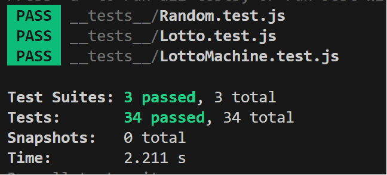

<h1 align="middle">🎱</h1>
<h2 align="middle">level1 - 행운의 로또</h2>
<p align="middle">자바스크립트로 구현 하는 로또 어플리케이션</p>

### 실행

```bash
 npm run start-step1
```

### 테스트

```bash
npm run test
```

### 실행 화면


### 테스트 실행 화면



### 도메인 로직

### 파일 구조

```
📦src
 ┣ 📂constant : 상수 관리
 ┃ ┣ 📜Messages.js : 입력, 입력힌트, 출력, 에러 메세지 관리
 ┃ ┗ 📜Options.js : 로또 가격, 로또 범위 최소, 최대 숫자, 상금, 게임 결과 등 관리
 ┣ 📂controller
 ┃ ┗ 📜LottoController.js : 로또 게임 진행
 ┣ 📂domain
 ┃ ┣ 📜Lotto.js
 ┃ ┗ 📜LottoMachine.js
 ┣ 📂util
 ┃ ┣ 📂random
 ┃ ┃ ┗ 📜Random.js
 ┃ ┣ 📂readLine
 ┃ ┃ ┗ 📜readLineAsync.js
 ┃ ┗ 📂validation
 ┃ ┃ ┣ 📜LottoNumbersValidator.js
 ┃ ┃ ┣ 📜PurchaseAmountValidator.js
 ┃ ┃ ┗ 📜Validation.js
 ┣ 📂view
 ┃ ┣ 📜InputView.js
 ┃ ┗ 📜OutputView.js
 ┣ 📜App.js
 ┣ 📜step1-index.js
 ┗ 📜step2-index.js

📦__tests__
 ┣ 📜.gitkeep
 ┣ 📜Lotto.test.js
 ┣ 📜LottoMachine.test.js
 ┗ 📜Random.test.js

```
