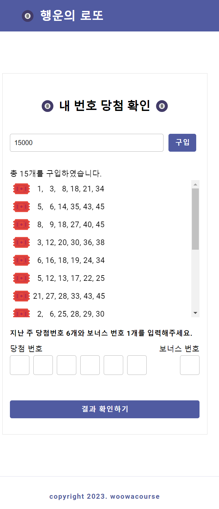

<h1 align="middle">🎱</h1>
<h2 align="middle">level1 - 행운의 로또</h2>
<p align="middle">자바스크립트로 구현 하는 로또 어플리케이션</p>

### 실행방법

```
npm install npm
npm run start-step1
npm run start-step2
```

배포 링크 : [클릭](https://skiende74.github.io/javascript-lotto/dist/)

감사합니다 !



### 폴더구조 간결요약

#### controller : 실행흐름, 입출력 담당

- MainController : 두 컨트롤러를 관리. + 게임끝난후 재시작흐름 담당
- PurchaseLottoController : 로또구매 실행흐름 담당
- WinningLottoController : 당첨 결과 실행흐름/입출력 실행흐름 담당

#### domain/entity

- IsRetry : 게임 다시시작 원시값래핑. 검증
- LottoNumber : 로또 번호 원시값 래핑. 검증
- Lotto : 로또 번호의 일급 컬렉션. 검증.
- WInningLotto : 당첨로또 자료형. 검증.

#### domain/service : 비즈니스로직. 계산

- PurchaseLottoService : 로또 구매. 구매한 로또 반환 담당
- WinningResultService : 당첨 통계 계산 담당
- WInningRewardService : 수익률 계산 담당

#### view : 입출력

- InputView : 입력 담당. 무한 재입력도 담당
- OutputView : 출력 담당.

여기까지는 STEP1

#### webView : web입출력을 위한 컴포넌트 ( STEP 2에서 추가된부분 )

- BaseComponent : customElements 베이스클래스.
- HeaderBar : 헤더부분 컴포넌트
- FooterBar : 푸터 컴포넌트
- MainApp : 앱 컴포넌트
- PurchaseLotto : 로또금액 입력부
- PurchasedLotto : 구매한 로또 컴포넌트
- Lotto : 출력되는 한줄의 로또 담당 컴포넌트
- ResultButton : 로또결과 버튼
- ResultModal : 로또 결과 모달
- WinningLotto : 로또 결과 내용 컴포넌트

customElements를 적용하였습니다. step2-index.js에서 호출됩니다.

# Step 2에서 고민한 사항 및 코드 의도

### step1의 코드변경 없이 재사용

기존 step1 코드의 변경 없이, step1 코드의 코드를 **재사용**합니다. Service레이어만 import해서 재사용하는 형태로 구현하였습니다. step2에서는 따로 컨트롤러가 필요하지않아따로 step2를 위한 컨트롤러는 만들지않았으며, webView에서 웹컴포넌트들이 Service 레이어를 호출해서 작동하고있습니다.

### Custom Elements 적용

html 컴포넌트가 비대해지는 것을 막기위해 **[custom elements]를** 적용하여 컴포넌트를 **분리**하였습니다. 이번에 custom elements를 처음적용해보았는데, 처음엔 이 custom elements라는 키워드라도 알았으면 좋았을텐데 이 키워드를 몰라서, 키워드를 알아내는 과정에 꽤 시간을 썼습니다.

컴포넌트 분리를 통해, 기존엔 수정사항이 생길 때 html과, css파일, 전부 이동해가면서 고쳐야했다면, 지금은 관심 컴포넌트끼리 모여있기 때문에 빠르고 정확한 수정이 가능하다고생각합니다.

### CSS 분리

CSS도 컴포넌트별로 분리하였습니다. 하지만, CSS Module은 현재는 적합하지않다고 판단하여 따로 적용하지 않았습니다. 처음에는 적용하였다가, CSS Module 적용시 클래스명이 맹글링되어 동일 컴포넌트에서조차 자식 태그에 css selector로 접근이 불가능해져 되돌렸습니다.

[custom elements]: https://developer.mozilla.org/en-US/docs/Web/API/Web_components/Using_custom_elements

## 시간상 진행하지 못해 아쉬운 부분

조금 더 진행할 수 있는 리팩토링이 있으나 시간이 부족하여 진행하지 못 한 부분이 있습니다. 하지만 이제 슬슬 PR을 보내야할 시간이라고 판단하여 더 진행하지는 못했습니다.

- webView/ResultModal 폴더의 ResultModalListener가 현재 깔끔하지 않습니다. 함수길이도 조금 길고, 상수를 뽑아낼 것들도 있고, 여러가지 일을 하고 있다고 판단됩니다. 애초에 이 파일을 없애고 ResultModal 클래스 및 다른 해당 책임 클래스에 퍼뜨려 깔끔하게 통합시킬 수 있을 거라고 생각합니다. 하지만 시간상 더 진행하지 못 하였습니다.
- 현재 각 컴포넌트들이 일부는 서로의 퍼블릭 메소드를 통해 메시지를 주고받고 있습니다만, 모든 컴포넌트(ResultModalListener 등)들이 그렇게 하지는 못하고있습니다. 일부는 querySelector로 직접 바꾸고있는 부분이 조금 있습니다. 컴포넌트끼리는 퍼블릭메소드로 메시지를 주고받게끔하면 조금 더 느슨한연결이 가능할 것 같습니다.

### 미션을 진행하면서 좋았던 부분
custom elements로 컴포넌트를 분리하고, css를 분리하고 하는 과정을 직접 겪으면서, 바닐라 JS (w. 웹팩) 환경에서 동적렌더링을 하는 경험을 해볼 수 있었던 것 같습니다.
CSS Module을 다시 사용해보면서 조금이나마 더 익숙해진 것 같습니다.

# Step 1에서 고민한 사항 및 코드 의도

## 가장 중요시 한 것

이번 프로젝트를 진행하면서 가장 중요하게 여긴 것은,

- **크론이 시연**한 것과 거의 완전히 동일한 방식으로 **TDD**를 해보는 것
- 클래스간의 **결합도를 최소한으로**.
- **리팩토링 내성을 가진 테스트코드** 작성이었습니다. 그 중에서도 결합도를 낮추는것과 리팩토링 내성을 가장 중요하게 생각하였습니다.

### TDD

- 수업 중에 보여준 TDD 순서를 **모두 그대로 따르려고** 노력했습니다.
- **테스트추가 -> 엉망진창 꼼수로 빠른 테스트통과 -> 리팩터링 순서.**
- 커밋메시지는 test, feat을 따로하지않고, 테스트구현후 -> 기능구현을 한 다음에 한꺼번에 feat으로 올렸습니다.

### TDD를 하면서 느낀 것

- TDD를 하기 전에 생각한 것 : TDD는 매우 많이 유용하지만, 설계를 갈아엎게 될 경우 **테스트 코드들이 전부 깨지기 때문에**, 그것들도 전부 갈아엎기 때문에 상황에 따라서는 **자칫 양날의 검이 될 수 있다**는 것입니다.
- TDD를 할 때 생각한 것 : TDD를 하는 경우 주의해야 할 것은, TDD로 할 경우는 테스트코드를 작성하기전에 **더욱 설계를 상당히 잘 해두어야 한다**는 생각을 하였습니다.
- TDD를 하고 나서 생각한 것 : 빨간불ㅡ파란불 테스트를 잘 해보니, 코드 작성 시에 **걱정이 상당히 줄어든다**는 것을 느꼈습니다. (빠른 피드백 효과)

## 결합도를 낮추려는 노력

### 클래스들의 인자(input) 및 출력 값은 ( 순수 JS 원시자료형 or JS Object) 으로

- 상황 : 최근, 클래스끼리 주고받는 값(메시지)로 **클래스 객체를 지양하고, JS 자료형을 사용하면 클래스간 결합도를 매우 낮출 수 있다는 점**을 많이 중요하게 인식하고 있습니다.
- 이에 따라 **클래스끼리 주고받는 값(메시지)은 무조건 JS 자료형**을 사용하여, 클래스 간의 결합도를 많이 낮췄습니다.
- 이를 통해 테스트코드의 import는 2개를 넘지 않도록 할 수 있는 등, 더욱 테스트 용이한 코드가 되어, **테스트코드의 리팩토링 내성**을 끌어올릴 수 있었습니다.
- 실제로 구현의 꽤 큰 규모 수정이 발생했을 때도 (두 핵심 클래스(LottoNumber,LottoNumberList)의 생성자수정), 테스트코드의 수정이나 구현의 수정이 매우 적게 발생하였습니다.

## 그 외 이번에 도입해 본 것

### 원시값 래핑과 일급 컬렉션 (First Class Collection) 사용

- 판단: 객체지향 생활체조에도 나오는 '중요 원시값은 래핑'은 이번에 로또번호에 도입하기에 매우 적합한 상황으로 판단.
- 이번에 로또 내의 숫자(LottoNumber)를 원시값 래핑하고
- 로또(LottoNumberList)는 그것을 담는 일급 컬렉션으로 구성하였습니다.
- 검증 로직 중복이 없고,
- 더 일관성 있고, 신뢰성 있게(1~45 무조건보장 등) 이용할 수 있어 좋았습니다.

### 기능목록 작성방법 변경

- 크론의 기능 목록 작성 시연을 보고, 그 방식이 좋다 느껴 적용해보았습니다.
- 기존엔 입력, 계산 , 출력 이런 식으로, 하고 프로그램 진행순서대로 나누는 방법에서 -> 클래스 단위로 기능 목록 작성으로 변경.
- 좋은 점 : TDD와 잘 어울리는 거 같습니다. 기능 목록 작성과정에서 클래스설계를 하게되어, 기능목록 작성 하는 동안 클래스설계를 할수있어 사전 클래스설계가 중요한 TDD에 도움이 되었다.

### 테스트코드 문구 컨벤션 변경

- 테스트코드 문구가 마치 기능목록을 대신할 수 있도록 하는 방법론(문구 컨벤션)에 감명을 받아 적용해보았습니다.
- 기존에 최대한 짧게 작성하던 방식에서 -> '언제, 어떤 조건이 주어졌을 때, 기대하는 결과' 형태로 작성하게 되었습니다.
- 개인적으로 마음에 들어 계속 이 컨벤션을 이용할 생각입니다.

### 페어프로그래밍하며 느낀 것

- 이번에는 페어에게 옆에서 이렇게저렇게하면 좋을거같아요. 이런 느낌보다 약간 옆에서 도와주는/설명해주는 느낌으로 해 보았는데 이 방식이 오히려 페어의 성장에도 도움이 된 것같고, 프로젝트 진행도 더 빨리, 스무스하게 된 것 같아서 좋았던 거 같다.

### 케빈에게 의견을 가볍게 묻고 싶은 것

저는 TDD를 할 때에는, 미 적용 경우(프로덕션구현->테스트구현순)보다 기본적으로 설계를 더 잘 해두어야 한다고 생각을 하였습니다. 케빈도 동일하게 생각하시는지 아닌지 가볍게 궁금합니다. (TDD에대한 다른 얘기도 괜찮습니다.)

- 이번에는 커밋메시지를 test 커밋과, feat커밋 이렇게 두번에 나누어서 커밋하지 않고, 테스트구현후 -> 기능구현을 한 다음에 한꺼번에 feat으로 커밋 메시지를 올렸는데, 케빈은 TDD를 할 경우 test, feat 순서로 분리해서 커밋을 하시는 편이신지 궁금합니다.
- 또, 이번에는
- 메소드 단위로 커밋을 하기도 하고, 클래스 단위(기능단위)로 커밋을하기도하였는데, 커밋은 작게하는 것이 좋다고는 하지만 너무 자주하기엔 커밋메세지작성이 오래걸리는거같습니다. 케빈은 보통 커밋 빈도를 어느정도로 맞추는 편인지 궁금합니다.
