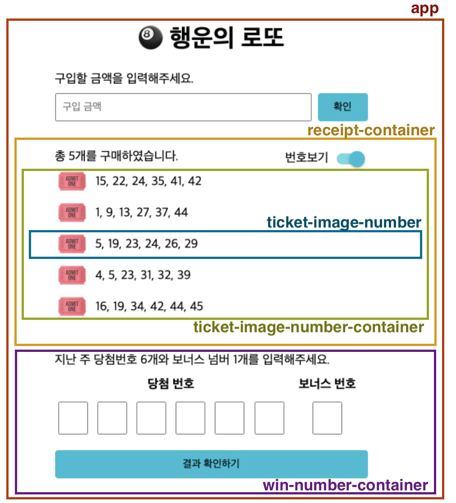

<p align="middle" >
  
</p>
<h2 align="middle">level1 - 행운의 로또</h2>
<p align="middle">자바스크립트로 구현 하는 로또 어플리케이션</p>
<p align="middle">


<a href="https://github.com/daybrush/moveable/blob/master/LICENSE" target="_blank">
  
  </a>
</p>

## 🔥 Projects!

<p align="middle">
  
</p>

[데모 페이지](https://jum0.github.io/javascript-lotto/)

## 구현할 기능

### 🧞‍♀️ step 1

- [x] 입력 창 아래를 숨김 처리한다.
- [x] 구입 금액 입력창에 숫자 입력을 할 수 있다.
  - [x] 최소 1000원 이상, 5000원 이하만 입력 가능하다.
  - [x] 1000의 배수만 입력 가능하다.
  - [x] 문자 및 공백은 입력 불가능하다.
- [x] 구입 금액을 입력하고 확인 버튼을 클릭하면 입력창 아래 로또 구매 내역 영역, 당첨 번호 입력, 결과 확인 버튼이 나타난다.
- [x] 총 구입한 로또의 개수만큼 로또가 생성되고, 텍스트(총 n개)에 반영된다.
- [x] 로또의 개수만큼 로또 용지 그림이 출력된다.
- [x] 토글 버튼을 클릭하면 각 로또의 번호가 출력된다.

### 🧞 step 2

- [x] 당첨 번호, 보너스 번호 입력창에 숫자 입력을 할 수 있다.
  - [x] 1\~45 범위 내에서만 입력 가능하다.
  - [x] 중복된 값은 입력 불가능하다.
  - [x] 문자 및 공백은 입력 불가능하다.
- [x] 결과 확인하기 버튼을 누르면 결과가 출력된다.
  - [x] 모달창이 나타난다.
  - [x] 각 티켓별 숫자 일치 개수 및 전체 티켓 당첨 개수를 저장한다.
  - [x] 모달창에 당첨 개수, 계산한 수익률을 반영한다.
- [x] 다시 시작하기 버튼을 누르면 초기화 돼서 다시 구매를 시작할 수 있다.
  - [x] 모달창이 닫힌다.
  - [x] 초기 상태로 돌아간다.

### 🧞‍♂️ step 3

- [ ] 구입할 금액을 입력하면 자동 및 수동 구매할 수 있는 창이 나타난다.
  - [ ] 구입할 금액의 잔액을 확인할 수 있다.
  - [ ] 현재 구매 현황을 확인할 수 있다.
- [ ] 자동 구매를 추가할 수 있다.
- [ ] 수동 구매를 추가할 수 있다.
- [ ] 구입할 금액의 잔액이 남아 있다면, 자동으로 구매할 수 있다.

---

### 🎯 step1 구입 기능

- [ ] 로꼬 구입 금액을 입력하면, 금액에 해당하는 로또를 발급해야 한다.
- [ ] 로또 1장의 가격은 1,000원이다.
- [ ] 소비자는 **자동 구매**를 할 수 있어야 한다.
- [ ] 복권 번호는 번호보기 토글 버튼을 클릭하면, 볼 수 있어야 한다.

### 🎯🎯 step2 당첨 결과 기능

- [ ] 결과 확인하기 버튼을 누르면 당첨 통계, 수익률을 모달로 확인할 수 있다.
- [ ] 로또 당첨 금액은 고정되어 있는 것으로 가정한다.
- [ ] 다시 시작하기 버튼을 누르면 초기화 되서 다시 구매를 시작할 수 있다.

### 🎯🎯🎯 step3 수동 구매

- [ ] 소비자는 수동 구매(스스로 구매 번호를 입력)를 할 수 있어야 한다.
  - 수동 구매를 위한 input UI는 스스로 구현한다.
- [ ] 수동 구매 후 남는 금액이 있다면 자동으로 구매할 수 있어야 한다.
- [ ] 위 기능들이 정상적으로 동작하는지 Cypress를 이용해 테스트한다.

<br>

## ⚙️ Before Started

####  로컬에서 서버 띄워서 손쉽게 static resources 변경 및 확인하는 방법

로컬에서 웹서버를 띄워 html, css, js 등을 실시간으로 손쉽게 테스트해 볼 수 있습니다. 이를 위해서는 우선 npm이 설치되어 있어야 합니다. 구글에 `npm install` 이란 키워드로 각자의 운영체제에 맞게끔 npm을 설치해주세요. 이후 아래의 명령어를 통해 실시간으로 웹페이지를 테스트해볼 수 있습니다.

```
npm install -g live-server
```

실행은 아래의 커맨드로 할 수 있습니다.

```
live-server 폴더명
```

<br>

## 👏 Contributing

만약 미션 수행 중에 개선사항이 보인다면, 언제든 자유롭게 PR을 보내주세요.

<br>

## 🐞 Bug Report

버그를 발견한다면, [Issues](https://github.com/woowacourse/javascript-lotto/issues)에 등록해주세요.

<br>

## 📝 License

This project is [MIT](https://github.com/woowacourse/javascript-lotto/blob/main/LICENSE) licensed.
