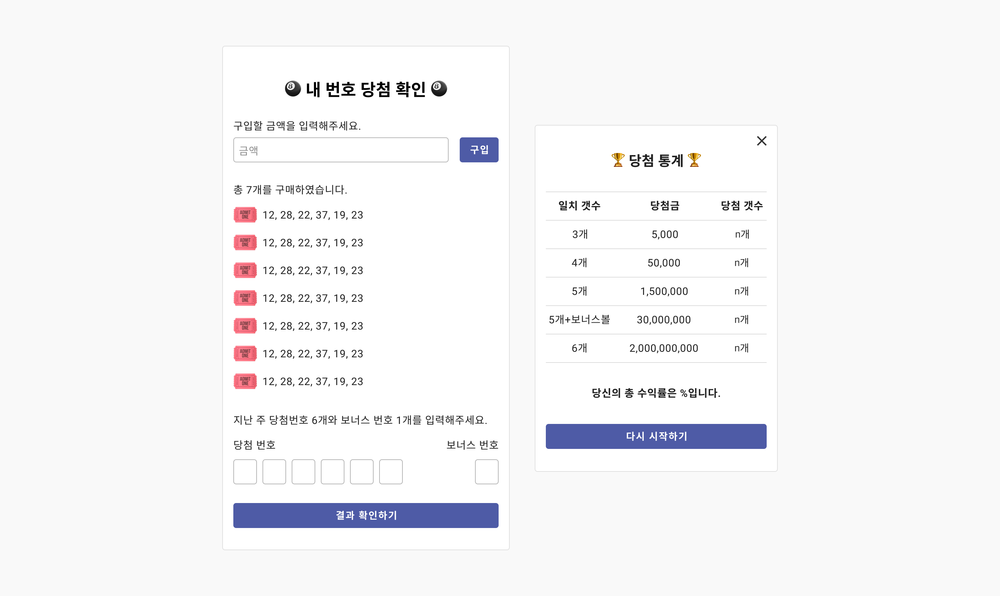

# 1단계 - 콘솔 기반 로또 게임

## 구현할 기능 목록

- [x] 로또 1장의 가격은 1,000원이다.
- [x] 로또 번호는 1부터 45 사이의 중복되지 않는 6개의 숫자로 구성된다.
- [x] 로또 번호는 오름차순으로 정렬하여 보여준다.

- [x] 구입 금액을 입력하면 금액에 해당하는 만큼 로또를 발행한다.
- [x] 구입 금액이 1,000원 미만이면 구매할 수 없다.

- [x] 당첨 번호 6개와 보너스 번호 1개를 입력받는다.
- [x] 보너스 번호는 1부터 45 사이의 숫자여야 하며 당첨 번호와 중복될 수 없다.

- [x] 구매한 로또와 당첨 번호를 비교하여 일치 개수와 보너스 번호 일치 여부를 확인한다.
- [x] 일치 결과에 따라 등수를 판별한다.
  - [x] 1등: 6개 번호 일치 / 2,000,000,000원
  - [x] 2등: 5개 번호 + 보너스 번호 일치 / 30,000,000원
  - [x] 3등: 5개 번호 일치 / 1,500,000원
  - [x] 4등: 4개 번호 일치 / 50,000원
  - [x] 5등: 3개 번호 일치 / 5,000원

- [ ] 등수별 당첨 개수를 집계하고 구매 금액 대비 수익률을 계산하여 출력한다.

- [ ] 사용자가 잘못된 값을 입력하면 에러 메시지를 출력하고 해당 부분부터 다시 입력받는다.
- [ ] 구입 금액, 당첨 번호, 보너스 번호, 재시작 여부(y/n)의 입력값을 검증한다.

- [ ] 당첨 통계를 출력한 뒤 재시작 여부를 입력받는다.
- [ ] 재시작하면 구입 금액 입력부터 다시 시작하고, 종료하면 프로그램을 끝낸다.

# 🚀 2단계 - 웹 기반 로또 게임

## 구현 할 기능 목록

### 로또 구매

- 구매 영역은 양수만 입력 가능하게 한다.
- 구입 금액을 잘못 입력했을 시 에러 메세지를 출력한다.
- `button` 을 누르면 로또가 구매되고 아래에 총 구매수와 로또 리스트를 출력

### 구매한 로또 목록 확인

- 구매 형식 : 총 `N`개를 구매하셨습니다.
- 로또 목록 : 리스트로 출력, 영역 초과시 스크롤 생성

### 당첨 번호 및 보너스 번호 지정

- 안내 메시지 출력
- 당첨번호와 보너스 넘버는 1~45까지 입력할 수 있게 한다.
- 보너스 넘버 클라이언트단에서 1차 검사

## 당첨 통계 확인

- 모달로 결과 출력
- 수익률 메세지 출력

## 게임 재시작

- 다시 시작하기 버튼 누를시 재시작 이벤트,웹 상태를 비우고 초기화 시킴
- x 누를시 모달닫기 이벤트, 데이터는 클라이언트에 저장된걸로 출력

## UI

- 헤더의 버튼 클릭 시, 새로고침 이벤트
- 웹 상태를 1차 저장하여, 입력값 가능할 때 버튼 활성화
