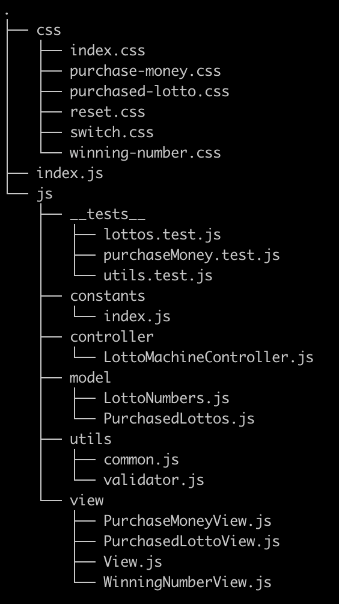
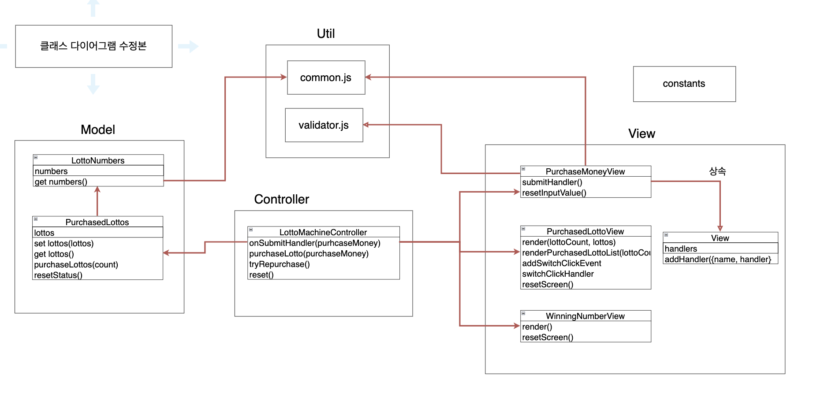

### 🎯 기능 요구사항 목록 🎯

 

#### 구입할 금액 입력 기능

- [x] [예외] 구입할 금액은 공백이어서는 안된다.
  - ` ` 입력 -> 에러 발생
- [x] [예외] 구입할 금액은 숫자 타입이어야 한다.
  - `abc` 입력 -> 에러 발생
- [x] [예외] 구입할 금액은 천원 단위만 입력할 수 있다.
  - `1250` 입력 -> 에러 발생
  - `1000.50` 입력 -> 에러 발생
  - `0` 입력 -> 에러 발생
  - `-1` 입력 -> 에러 발생
- [x] 예외 발생시, alert 경고창을 발생시킨다.

 

#### 토글 기능

- [x] 디폴트 값은 `off` 상태이다.
- [x] `on` 상태일 때는 구입한 로또의 번호를 볼 수 있다.

 

#### 로또 구입 기능

- [x] 로또는 1 ~ 45 사이의 번호로 이루어져 있다.
- [x] 로또는 총 6개의 번호를 가진다.
- [x] 로또는 중복된 번호를 가질 수 없다.

 

#### 로또 당첨번호 입력 기능

- [x] [예외] 양의 정수만 입력 가능하다.
  - `1000.50` 입력 -> 에러 발생
  - `0` 입력 -> 에러 발생
  - `-1` 입력 -> 에러 발생
- [x] [예외] 1 ~ 45 사이의 번호를 입력 해야 한다.
  - `[1, 5, 10, 14, 35, 50, 12]` -> 에러 발생
- [x] [예외] 중복된 번호를 입력할 수 없다.
  - `[1, 2, 40, 20, 1, 8, 9]` 입력 -> 예러 발생
- [x] [예외] 모든 값을 입력해야 한다.
  - `[1, 5, 10, 14, 35, 45]` -> 에러 발생
- [x] 예외 발생시, alert 경고창을 발생시킨다.
- [x] [추가] 당첨번호를 정상 입력시, 자동으로 다음 입력태그로 focus된다.

 

#### 결과 확인하기 모달창 기능

- 당첨 통계 확인 기능
  - [x] 일치 갯수가 `3개`인 로또 갯수를 확인할 수 있다.
  - [x] 일치 갯수가 `4개`인 로또 갯수를 확인할 수 있다.
  - [x] 일치 갯수가 `5개`인 로또 갯수를 확인할 수 있다.
  - [x] 일치 갯수가 `5개+보너스볼`인 로또 갯수를 확인할 수 있다.
  - [x] 일치 갯수가 `6개`인 로또 갯수를 확인할 수 있다.
- 수익률 확인 기능
  - [x] 총 수익률을 확인할 수 있다.

 

#### 다시 시작하기 기능

- [x] 다시 시작하기 버튼 클릭 시, 초기 화면으로 리셋 된다.

 
 
 

---

### 파일 구조도(수정본)

 

  

 
 

---

### 클래스 다이어그램(수정본)

 
 

  

---
