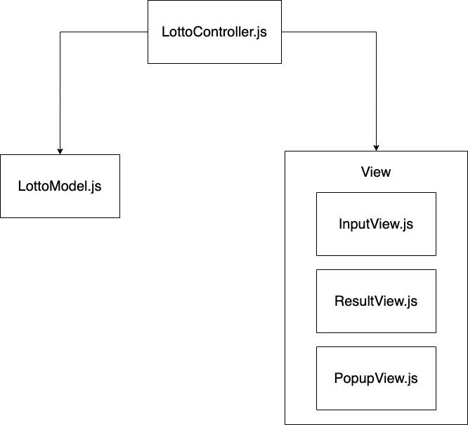

# 🎱행운의 로또
## 프로그램 설명 
사용자가 1장당 1000원인 로또를 구입하고, 로또 번호는 랜덤으로 생성된다. 지난주 당첨번호 6개와 보너스 번호 1개를 입력하면, 사용자가 구매한 로또들과 지난주 당첨번호를 비교 및 계산하여 사용자가 구매한 로또가 몇등으로 당첨되었는지 알려준다. 

## 구조도

## 기능 구현 사항

- [x] 로또금액을 입력할수 있다.
  - [예외] 금액은 1000단위로 나누어 져야한다.
  - [예외] 금액은 1000원 이상이여야 한다.
  - [예외] 숫자를 제외한 입력이 들어오면 안된다.

- [x] 구입버튼을 클릭시 로또가 구입한 개수만큼 보여진다.
  - [x] 번호보기 스위치를 클릭하여 로또 번호를 숨기고 보여줄수 있다.
  - [x] 로또번호는 1 ~ 45까지의 숫자중에서 랜덤으로 6개의 숫자를 보여준다.

- [x] 구입버튼을 클릭시 당첨번호를 입력하는 창을 보여준다.
  - [x] 당첨번호 6개와 보너스 번호를 입력할수 있다.
    - [예외] 중복된 번호를 입력하면 안된다.
    - [예외] 범위(1 ~ 45)를 벗어난 숫자를 입력하면 안된다.
    - [예외] input창이 모두 입력되어야한다.
- [x] 결과 확인하기 버튼을 누르면 일치하는 갯수와 수익률을 계산하여 보여준다.
  - [x] 결과창을 제외하고는 클릭을 막는다.
  - [x] 결과창의 X를 클릭하면 결과창이 닫긴다.
  - [x] 일치하는 갯수와 수익률을 계산하여 보여준다.
- [ ] 다시 시작하기 버튼을 누를시 초기창으로 돌아간다.

## 리팩터링 
- [ ] handle 머시기 네이밍 바꾸기 
- [x] submitLottoPriceHandler 네이밍 -> handleLottoPriceButtonSubmit
- [x] const { value } 이름 
- [ ] 리뷰어님  
  - [x] this.model 이름 변경 
  - [x] getLottoNumbers 네이밍 변경 
  - [x] setLottoCount 네이밍 수정
  - [ ] 이벤트 등록의 책임 View로 옮기기 
  - [ ] LottoModel의 while문 수정 (무한루프)
  - [ ] lottoCount 상태로 둘지 고민 

  - [ ] app.test.js에서 로또 숫자가 중복된 케이스도 추가 -> generateLottoNumbers에서 Set을 사용해서, 로또 번호에 중복된 숫자가 나올 가능성이 없음.
  - [ ] generateLottos for문 대신 메서드 사용 -> 반복횟수가정해져있는경우는 for, while 사용해야하는 것 아닌지?

- [ ] 페어 리뷰어님 
  - [x] controller에서 setLottoCount, setLottos를 굳이 노출할 필요가 없다. (읽으면 뭐하는지 잘 모름)controller에서는 행동기반으로 작성! (두개 합쳐서 buyLottos와 같이)
  - [x] value.match(/[0-9]/) 부분을 Number.isInteger를 사용해서 변경 
  - [x] 셀렉터 상수로 분리 ($, $$와 같이)
  - [x] app.test.js에서 LOTTO_NUMBERS, ALERT_MESSAGE 에 있는 데이터 이용해서 검증하기 
  - [x] input type="number"에 대한 것의 value를 가져오고 싶을 때, valueAsNumber를 사용해보기 (submitLottoPriceHandler)
  - [x] 로또 구매 가능 최대 개수 설정 (100개 추천)
  - [ ] 실제 로또처럼 한번 뽑힌 로또에 대해서는 다시 안뽑히게 작성해보기 (lottoModel의 while문)
  - [ ] model에서, getter와 setter를 통해서만 데이터에 접근하고 싶으면 private 사용해보기 

- [ ] 수업 1단계 피드백 
  - [x] 태그 100% 사용(input-min, max, required 속성 사용해보기)
  - [ ] 사용성 생각 (사용자가 로또 사기 쉽게!, 웹접근성 자료 읽어보기)
    - [ ] catch문 error메시지
    - [ ] lotto 최대구매가능개수 설명
    - [ ] lotto 금액 입력 
- [ ] input 기본 에러 메시지 커스텀 해보기 
## 질문 
- css에서 * 사용 
- dom 탐색 expensive... 
- import문 구분 너무 과하지 않은지 
- input의 min, max, required 속성을 추가해줘서, 이 조건을 만족못할시 input 자체에서 끊어준다. (alert메시지 안뜸.) 그렇다면, validator에서 이를 검증하지 않아도 될까요?