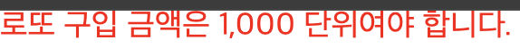

# 🎱 웹 기반 로또 애플리케이션

## 도메인

### 로또

- 로또는 1 ~ 45의 6개의 숫자로 구성되어있다.

다음의 유효성 검증을 진행한다.

- [x] 숫자가 아닌 문자열이 들어오면 안된다.
- [x] 6개의 숫자로 구성되어야 한다.
- [x] 1 ~ 45 사이의 숫자여야 한다.
- [x] 로또는 중복된 숫자를 가질 수 없다

- [x] 로또 도메인은 당첨 로또와 비교했을 때, 몇개 일치하는지 판단하고 결과를 외부에 전달한다.

### 당첨 로또

- 당첨 로또는 6개의 로또 번호와 보너스 번호를 가진다.

다음의 유효성 검증을 진행한다.

- [x] 숫자가 아닌 문자열이 들어오면 안된다.
- [x] 6개의 숫자로 구성되어야 한다.
- [x] 1 ~ 45 사이의 숫자여야 한다.
- [x] 로또는 중복된 숫자를 가질 수 없다
- [x] 당첨 로또 6개와 보너스 번호는 중복될 수 없다.

### 로또 상점

- [x] 로또 구입 금액을 입력하면 구입 금액에 해당하는 만큼 로또를 발행해야 한다.
- 로또 1장의 가격은 1,000원이다.

다음의 유효성 검증을 진행한다.

- [x] 로또 가격은 문자열(공백)이 될 수 없다.
- [x] 로또 가격은 1,000으로 나누어떨어져야 한다.

### 로또 결과

- [x] 로또 결과판을 만든다.
  - 등수와 각 등수의 갯수 정보로 구성되어있다.
- [x] 수익률을 계산한다.
  - 수익률은 `총 당첨금/구입 금액`이다.
  - 수익률은 반올림하여 소수점 2자리 수까지 계산한다.
- 당첨은 1등부터 5등까지 있다. 당첨 기준과 금액은 아래와 같다.

```text
1등: 6개 번호 일치 / 2,000,000,000원
2등: 5개 번호 + 보너스 번호 일치 / 30,000,000원
3등: 5개 번호 일치 / 1,500,000원
4등: 4개 번호 일치 / 50,000원
5등: 3개 번호 일치 / 5,000원
```

## 입력

- [x] input 태그를 활용하여 로또 구입 금액을 입력받는다.
- [x] 유효하지 않은 입력의 경우 에러 메시지를 input 태그 아래에 표시한다



- [x] input 태그를 활용하여 지난 주 당첨 번호 6개와 보너스 번호를 입력 받는다.
- [x] 유효하지 않은 입력의 경우 에러 메시지를 input 태그 아래에 표시한다


## 출력

- [x] 상단바에 **🎱 행운의 로또** UI를 구성한다.
- [x] 하단바에 **Copyright 2024 woowacourse** UI를 구성한다.
- [x] **🎱 내 당첨 번호 확인 🎱** UI를 구성한다.
- [x] 발행한 로또 번호 UI를 구성한다.
- [x] 팝업 UI를 활용하여 로또 당첨 결과와 수익률을 보여준다.
