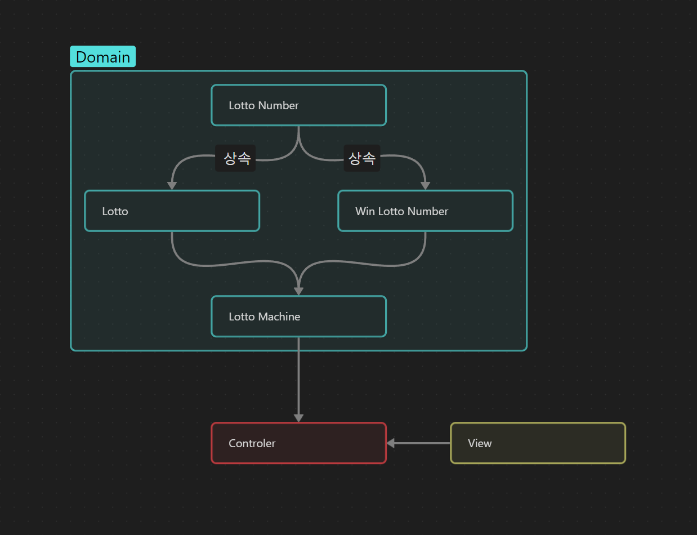

## 😛기능 구현 목록

### Domain

1. Lotto Number

   1. 필드
      - LottoNumbers
   2. Valid
      - [x] 1~45 숫자인지 확인하고, 중복 검사, 숫자가 6개인지 검사

2. Lotto

   1. 필드
      -Rank
   2. [x] 당첨 번호를 입력 받아서 몇 등인지 Rank에 저장. 당첨은 1등부터 5등까지 있다.

3. Lotto_machine

   1. 필드

      - winLottoNumbers
      - lottos

   1. [x] 구입 금액에 해당하는 만큼 로또를 발행
   1. [x] 로또 1장의 가격은 1,000원이다.
      - 최소 1000원 이상이어야 한다.
   1. [x] Lotto 번호를 발행.( 1 ~ 45의 중복되지 않은 숫자를 발행한다.)

4. WinLottoNumbers
   1. [x] 당첨 번호 입력 값을 통해 WinLottoNumbers에 대한 유효성 검증
   2. [x] bonusNumber에 대한 유효성 검증

### View

1.  [ ] 로또 구입 금액을 입력한다.
2.  [ ] 로또 번호는 오름차순으로 정렬하여 보여준다.
3.  [ ] 당첨 번호와 보너스 번호를 입력받는다.
4.  [ ] 당첨 내역 및 수익률을 출력한다.
5.  [ ] 당첨 통계 출력
    ```
      1등: 6개 번호 일치 / 2,000,000,000원
      2등: 5개 번호 + 보너스 번호 일치 / 30,000,000원
      3등: 5개 번호 일치 / 1,500,000원
      4등: 4개 번호 일치 / 50,000원
      5등: 3개 번호 일치 / 5,000원
      총 수익률은 62.5%입니다.
    ```
6.  [ ] 당첨 통계를 출력한 뒤에는 재시작/종료 여부를 입력받는다.

## 😛기타 요구 사항

1. 재시작할 경우 구입 금액 입력부터 게임을 다시 시작하고, 종료하는 경우 그대로 프로그램을 종료시킨다.
2. 사용자가 잘못된 값을 입력한 경우 throw문을 사용해 예외를 발생시키고, 에러 메시지를 출력 후 그 부분부터 입력을 다시 받는다.

## 😛설계

1. 기본적인 설계 => MVC가 나누어 짐. 어떤 객체를 만들어야할지 감 잡기.
2. 기능 목록을 작성하면서, 테스트 코드를 같이 쓴다. RED 3. 기능 구현을 합니다.
3. 다시 2번으로 -> test: 커밋
4. 기능구현을 하나씩 하면서, todo check commit -> docs/requirement commit
5. App 말고 모든게 구현됨.
6. App 합체 -> 기능구현 완료.


